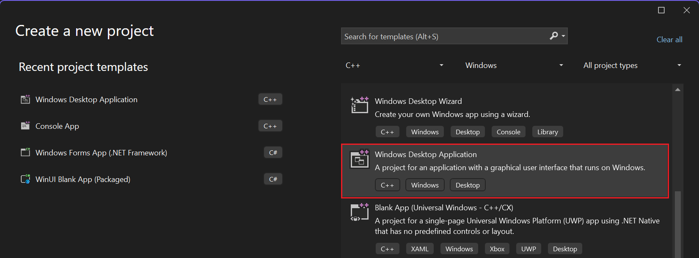
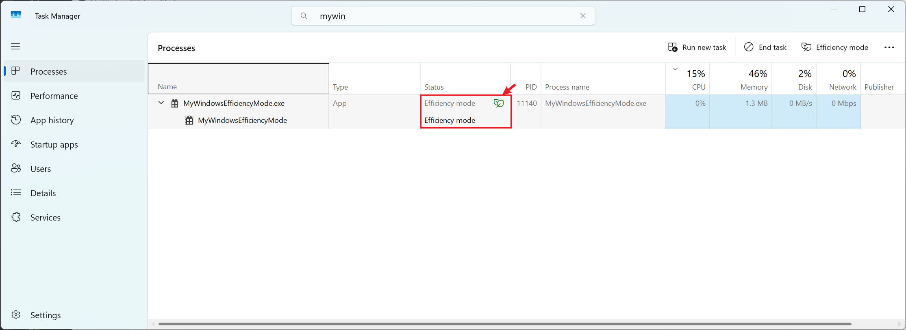
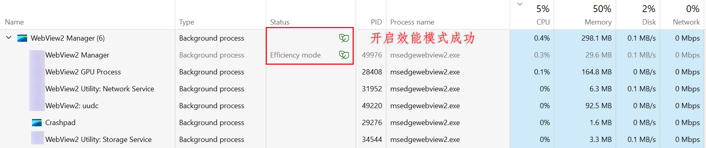

# Windows 效能模式

如何在 C++ 和 WebView 里面开启 效能模式，降低程序的功耗。 其支持平台 Win11 22H2。 原理和介绍参见如下

- [Windows 11 效率模式简介及使用](https://www.sysgeek.cn/windows-11-efficiency-mode/)
- [什么是Win11效率模式及如何使用它](https://win.bandwh.com/opti/683.html)


**编译环境:** Win11 24H2  VS2022


## MyWindowsEfficiencyMode （C++）

- C++ windows 版本代码，添加如下代码，然后运行  EnableEfficiencyModeForCurrentProcess() 函数

```cpp
#include <windows.h>
#include <iostream>

// 开启 Efficiency Mode 的函数
void EnableEfficiencyModeForCurrentProcess()
{
    HANDLE hProcess = GetCurrentProcess();

    // 1. 降低调度优先级至 Idle
    SetPriorityClass(hProcess, IDLE_PRIORITY_CLASS);

    // 2. 启用 EcoQoS 节能模式
    PROCESS_POWER_THROTTLING_STATE pts = {};
    pts.Version = PROCESS_POWER_THROTTLING_CURRENT_VERSION;
    pts.ControlMask = PROCESS_POWER_THROTTLING_EXECUTION_SPEED;
    pts.StateMask = PROCESS_POWER_THROTTLING_EXECUTION_SPEED;

    if (!SetProcessInformation(
        hProcess,
        ProcessPowerThrottling,
        &pts,
        sizeof(pts)))
    {
        DWORD err = GetLastError();
        std::cerr << "开启 EcoQoS 失败，错误码：" << err << "\n";
    }
    else {
        std::cout << "效率模式已启用\n";
    }
}
```




**运行效果**




## WebView2 (微软自带库)

`int APIENTRY wWinMain(_In_ HINSTANCE hInstance, _In_opt_ HINSTANCE hPrevInstance, _In_ LPWSTR lpCmdLine, _In_ int nCmdShow)`

里面调用  EnableEfficiencyModeForCurrentProcess() 函数可以开启 C++ windows 窗口开启效能模式


**WebView** 

对于上面窗口里面嵌套 WebView 窗口，由于 WebView  是独立的，需要单独任务管理器中搜索；

webview 加载的代码附近如下

```cpp
	ComPtr<ICoreWebView2Environment3> webViewEnvironment3;
	m_webViewEnv->QueryInterface(IID_PPV_ARGS(&webViewEnvironment3));
	HRESULT hr = webViewEnvironment3->CreateCoreWebView2CompositionController(m_hMainWnd, Callback<ICoreWebView2CreateCoreWebView2CompositionControllerCompletedHandler>(
		this, &AppWindow::xxxxfunction).Get());
```

在 附近的 `xxxxfunction` 函数里面去添加如下代码

```cpp
// 启用 WebView2 子进程的效率模式（EcoQoS）
UINT32 pid = 0;
if (SUCCEEDED(g_webView->get_BrowserProcessId(&pid)) && pid != 0) {
    HANDLE hProcess = OpenProcess(PROCESS_SET_INFORMATION | PROCESS_QUERY_LIMITED_INFORMATION, FALSE, pid);
    if (hProcess) {
        SetPriorityClass(hProcess, IDLE_PRIORITY_CLASS);

        PROCESS_POWER_THROTTLING_STATE pts = {};
        pts.Version = PROCESS_POWER_THROTTLING_CURRENT_VERSION;
        pts.ControlMask = PROCESS_POWER_THROTTLING_EXECUTION_SPEED;
        pts.StateMask = PROCESS_POWER_THROTTLING_EXECUTION_SPEED;
        SetProcessInformation(hProcess, ProcessPowerThrottling, &pts, sizeof(pts));
        CloseHandle(hProcess);
    }
}
```


开启成功截图

