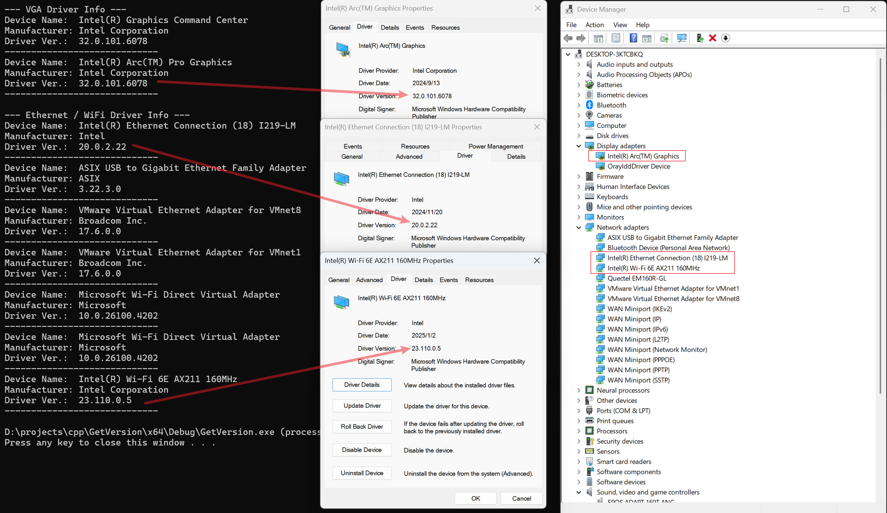

**介绍**

获取 VGA、Ethernet **驱动的本身**版本号，以及**驱动文件的**版本号； 

原理是走 WMI 的 Win32_PnPSignedDriver API；

**源码**

编译环境：Win11 24H2 VS2022

【GetVersion】 使用 WMI 的 Win32_PnPSignedDriver 获取显卡和驱动本身的版本号
【SetupAPI】   获取的驱动版本是驱动文件（sys）文件的版本号，而不是驱动本身的完整版本号

**运行截图**

